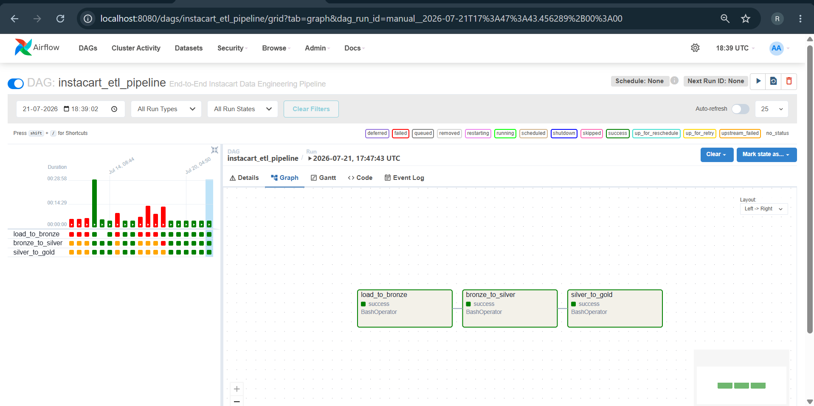
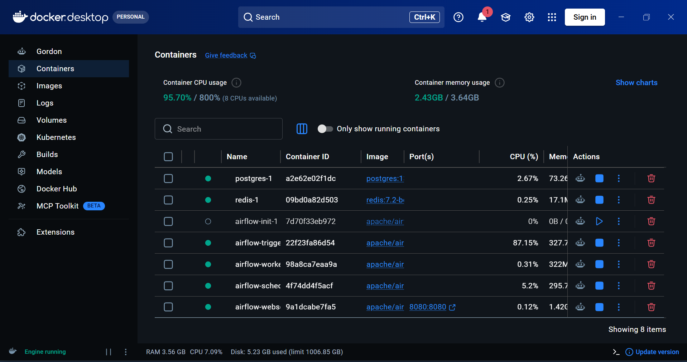
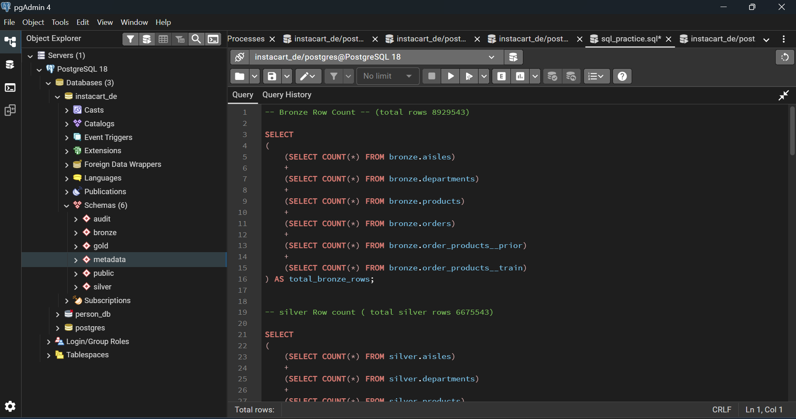
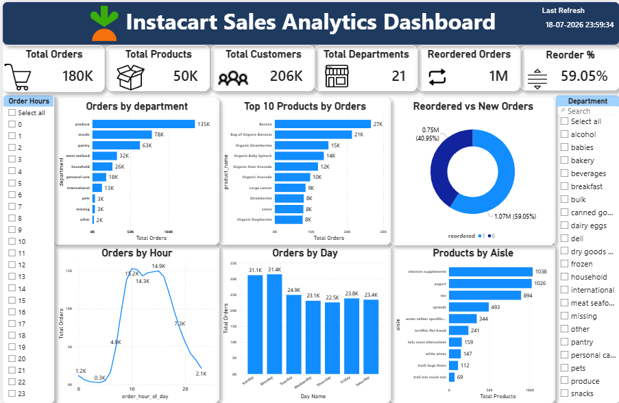

# Instacart End-to-End Data Engineering Pipeline

## Project Overview

This project implements an End-to-End Data Engineering Pipeline using the Instacart Dataset. The pipeline follows the Medallion Architecture (Bronze, Silver, Gold) and is orchestrated using Apache Airflow running on Docker with CeleryExecutor. PostgreSQL is used as the data warehouse, and Power BI is used for business reporting and visualization.

---

## Architecture

```
                    Instacart CSV Files
                            │
                            ▼
                  Apache Airflow (DAG)
                            │
                            ▼
                  Python ETL Pipeline
                            │
         ┌──────────────────┼──────────────────┐
         ▼                  ▼                  ▼
     Bronze Layer      Silver Layer      Gold Layer
         │                  │                  │
         └──────────────────┼──────────────────┘
                            ▼
                     PostgreSQL Database
                            │
                            ▼
                     Power BI Dashboard
```

---

## Technology Stack

- Python
- PostgreSQL
- Apache Airflow
- Docker
- Redis
- SQLAlchemy
- Pandas
- Power BI
- Git
- GitHub

---

## Project Structure

```
Instacart-End-to-End-Data-Engineering-Pipeline

├── airflow/
│   └── dags/
├── config/
├── docker/
├── sample_data/
├── scripts/
│   ├── ingestion/
│   ├── load/
│   ├── transformation/
│   ├── validation/
│   ├── metadata/
│   ├── audit/
│   └── logging/
├── README.md
├── requirements.txt
└── .gitignore
```

---

## Pipeline Workflow

### Step 1 – Data Ingestion

- Read Instacart CSV files
- Load raw data into PostgreSQL Bronze schema
- Chunk-based loading for better performance
- Skip already loaded tables

---

### Step 2 – Bronze Layer

- Stores raw data
- No transformation
- Maintains original dataset

---

### Step 3 – Silver Layer

- Data Cleaning
- Remove duplicates
- Handle NULL values
- Trim text columns
- Apply business validation rules
- Create cleaned tables

---

### Step 4 – Gold Layer

- Business-ready tables
- Optimized for reporting
- Used by Power BI

---

## ETL Pipeline

```
CSV Files
     │
     ▼
load_to_bronze.py
     │
     ▼
bronze_to_silver.py
     │
     ▼
incremental_load.py
     │
     ▼
gold tables
     │
     ▼
Power BI Dashboard
```

---

## Features

- Medallion Architecture
- Bronze Layer
- Silver Layer
- Gold Layer
- Apache Airflow DAG
- Docker Compose Setup
- PostgreSQL Database
- Redis Queue
- CeleryExecutor
- Incremental Loading
- SCD Type 1
- SCD Type 2
- Data Validation
- Metadata Framework
- Audit Framework
- Logging
- Power BI Dashboard

---

## Database Schemas

- Bronze
- Silver
- Gold
- Audit
- Metadata

---

## Airflow Components

- Webserver
- Scheduler
- Worker
- Triggerer
- PostgreSQL
- Redis

---

## Power BI Dashboard

The dashboard provides:

- Customer Insights
- Product Analysis
- Department Analysis
- Order Analysis
- KPI Cards
- Interactive Reports

## Project Screenshots

## Airflow DAG



---

## Docker Containers



---

## PostgreSQL Schemas



---

## Power BI Dashboard



## Future Improvements

- AWS S3 Integration
- Snowflake Integration
- Kafka Streaming
- CI/CD Pipeline
- Unit Testing
- Data Quality Monitoring
- Dockerized ETL Pipeline

---

## Author

**Rushikesh Sudam Bhosale**

**GitHub:** https://github.com/rushi3303

**LinkedIn:** https://www.linkedin.com/in/rushikeshbhosale